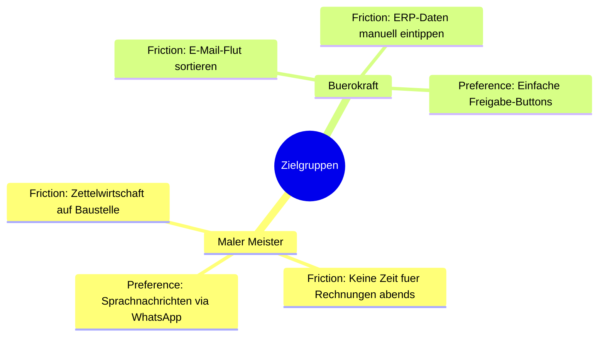

# 🎯 Entwicklungs-Doktrin & Kernprinzipien
*Die Leitphilosophie von Handwerk AI*

Dieses Dokument beschreibt die philosophischen Leitsätze, nach denen jede Funktion, jeder Dienst und jeder Agent konzipiert werden muss. Abweichungen von diesen Prinzipien gefährden die Benutzerakzeptanz und die Rechtskonformität.

---

## 1. Die Mission: Bürokratieabbau für Handwerker

Unsere Zielgruppe sind kleine und mittelständische Handwerksbetriebe (Maler, Dachdecker, Sanitär/Heizung/Klima) und deren Büromitarbeiter. Diese leiden unter stetig wachsendem administrativem Aufwand.

### 🐴 Die "Trojanisches Pferd"-Strategie
- **Kein Tech-Hype**: Wir verkaufen keine "Künstliche Intelligenz", keine "neuronalen Netze" und keinen KI-Hype.
- **Die Botschaft**: Unser Pitch lautet schlicht: *"Wir sparen Ihrem Büro 15 Stunden Papierkram pro Woche"*.
- **Konsequenz**: Benutzeroberflächen müssen unsichtbar sein. Die bestehenden, gewohnten Kanäle des Handwerkers sind das Interface (WhatsApp, E-Mail).

### 👥 Zielgruppen-Personas & Friction Points

1. **Der Meister (auf der Baustelle)**: Hat schmutzige Hände, steht auf dem Gerüst, will keine neue App lernen. Seine bevorzugte Kommunikation ist die **WhatsApp-Sprachnachricht** oder ein schnelles Foto.
2. **Die Bürokraft (im Büro)**: Verbringt Stunden damit, Rechnungen einzutippen, Zeiten abzugleichen und E-Mails zu sortieren. Sie wünscht sich ein einfaches **Freigabe-Dashboard** (Human-in-the-Loop), das ihr Arbeit abnimmt, statt sie zu verkomplizieren.

---

## 2. Kernprinzipien (Visions-Check)

### 2.1 Code over Low-Code (Middleware-Prinzip)
- Workflow-Plattformen (n8n, Make.com) dienen **ausschließlich** als API-Proxy, Webhook-Empfänger und "Klebstoff" zwischen Systemen.
- Die eigentliche **Geschäftslogik**, Validierungen, Datenbankzugriffe und KI-Entscheidungen werden in **Python (FastAPI) Microservices** abgebildet.
- *Begründung*: Reine Low-Code-Lösungen lassen sich schlecht versionieren, testen und skalieren, sobald die Automatisierungsdichte steigt.

### 2.2 Human-in-the-Loop & Low-Barrier
- **Freigabe-Pflicht (No Auto-Actions)**: Die KI darf **niemals** selbstständig E-Mails an Kunden senden, Angebote verschicken oder Zahlungen anstoßen. Sie bereitet Antwortentwürfe oder PDF-Belege vor und legt sie zur Freigabe (z.B. in Baserow) bereit.
- **Low-Barrier Interfaces**:
  - **WhatsApp Ingestion**: Sprachnachrichten werden transkribiert, Baustellen-Fotos via Vision-LLM analysiert, und Daten direkt im ERP/Posteingang strukturiert.
  - **E-Mail Drafting**: E-Mails werden automatisch kategorisiert und Antwort-Entwürfe im IMAP-Entwurfsordner abgelegt, sodass der Handwerker sie in Outlook/Thunderbird nur noch öffnen und absenden muss.

---

## 3. Kompromisslose DSGVO-Konformität (Datenschutz als USP)

Da Handwerksbetriebe sensible Kundendaten (Namen, Adressen, Fotos von Privaträumen) verarbeiten, ist Datenschutz unser stärkstes Verkaufsargument.

> [!WARNING]
> **Strikte Datenminimierung (Datenschutz-Dogmen)**:
> 1. **EU-Hosting**: Alle Systeme (Datenbanken, FastAPI Backend, n8n, Baserow, lokales Whisper/Ollama) laufen auf Hetzner-Servern in Deutschland (Falkenstein).
> 2. **Enterprise-LLM-Gateways**: Personenbezogene Daten dürfen nur an externe LLMs (z.B. OpenAI, Anthropic) weitergeleitet werden, wenn ein verifiziertes **Zero Data Retention (ZDR)** Agreement vorliegt (Modelle dürfen nicht mit Kundendaten trainiert werden; Daten müssen nach 30 Tagen gelöscht werden).
> 3. **Daten-Siloing**: Daten verschiedener Mandanten dürfen niemals in derselben PostgreSQL-Datenbank-Instanz gemischt werden. Strikte Container- und Port-Trennung pro Mandant ist Pflicht.
