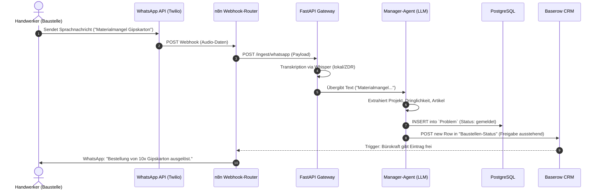
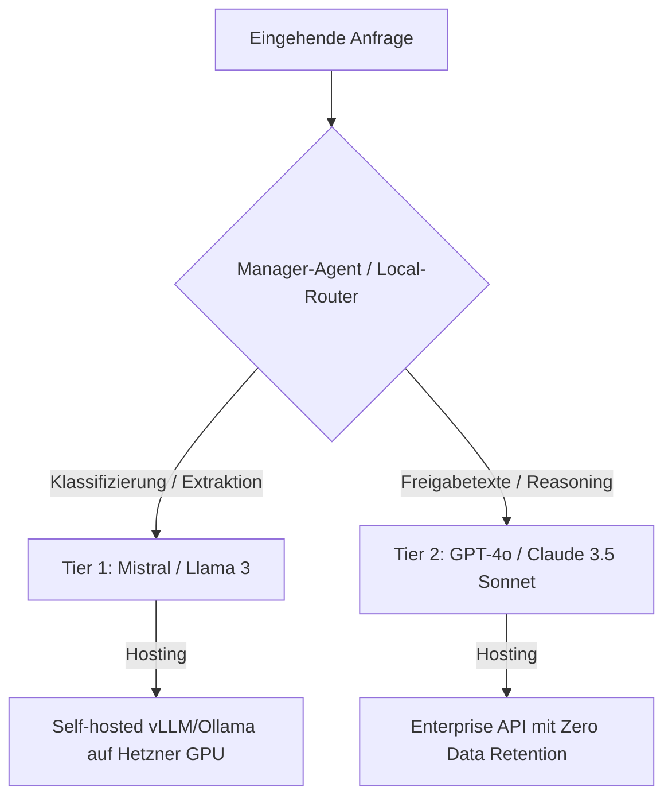

# 🏗️ Technische Infrastruktur & Tech-Stack
*Systemarchitektur und Datenflüsse*

Alle technischen Komponenten müssen dem hier definierten Stack und Routing entsprechen. Vorschläge, die alternative Cloud-Anbieter (wie AWS, GCP, Azure) oder proprietäre, nicht-DSGVO-konforme Systeme einbinden, sind unzulässig.

---

## 1. Datenfluss-Diagramm (WhatsApp-to-ERP Ingestion)

Das folgende Diagramm zeigt den Datenfluss von einer Baustellen-Sprachnachricht bis zur strukturierten Bereitstellung im CRM zur Freigabe:

---

## 2. Der Core Tech-Stack

### 2.1 Server & Hosting (Bare-Metal / VPS)
- **Hoster**: Hetzner Cloud (Falkenstein/Nürnberg, Deutschland).
- **Betriebssystem**: Ubuntu Server LTS (gehärtet).
- **Mandantentrennung**: Docker & Docker Compose. Jede Firma läuft auf einem eigenen Subnetz im Docker Daemon (Isolierung der Datenbanken und Volumes).

### 2.2 Middleware & Ingestion-Layer
- **n8n (Self-Hosted in Docker)**:
  - Empfängt Webhooks von WhatsApp (Twilio/360dialog) und Mail-Servern (IMAP).
  - Leitet die Payloads an das FastAPI Gateway weiter.
  - Verwaltet OAuth2-Handshakes für Kalender (Google/Outlook).
- **FastAPI Gateway (Python)**:
  - Nimmt Anfragen von n8n entgegen.
  - Übernimmt die Authentifizierung (JWT).
  - Führt die lokale Transkription (Whisper.cpp/Faster-Whisper) oder Bildkompression aus.

---

## 3. KI-Routing & LLM-Strategie

Um Kosten zu sparen und die DSGVO zu wahren, routet der **Manager-Agent** Anfragen dynamisch:

- **Tier 1 (Einfache Aufgaben)**: Entitäten-Extraktion, Klassifizierung, Spam-Filterung.
  - *Modelle*: `Llama-3-8B-Instruct`, `Mistral-7B-Instruct`.
  - *Infrastruktur*: Eigene vLLM/Ollama Instanz auf Hetzner GPU-Servern (oder EU-gehostete datenschutzkonforme Schnittstellen).
- **Tier 2 (Reasoning & Textformulierung)**: Komplexe Beleg-Generierung, E-Mail-Formulierung.
  - *Modelle*: `Claude-3-5-Sonnet`, `GPT-4o`.
  - *Infrastruktur*: API-Endpunkte mit vertraglich zugesichertem **ZDR (Zero Data Retention)**.

---

## 4. Speicher- und API-Registry

- **PostgreSQL**: Datenhaltung für strukturierte Daten (Mandanten, Benutzer, Aufgaben, Leads).
- **MinIO / S3-kompatibel**: Speicherung von Binärdaten (Fotos, Audioaufnahmen, PDF-Rechnungen) in der EU.
- **Baserow (Self-Hosted)**: Das NoCode-Frontend. Handwerker und Büroleiter sehen hier ihre Leads, Rechnungsentwürfe und Aufgaben und können diese per einfachem Klick freigeben.
