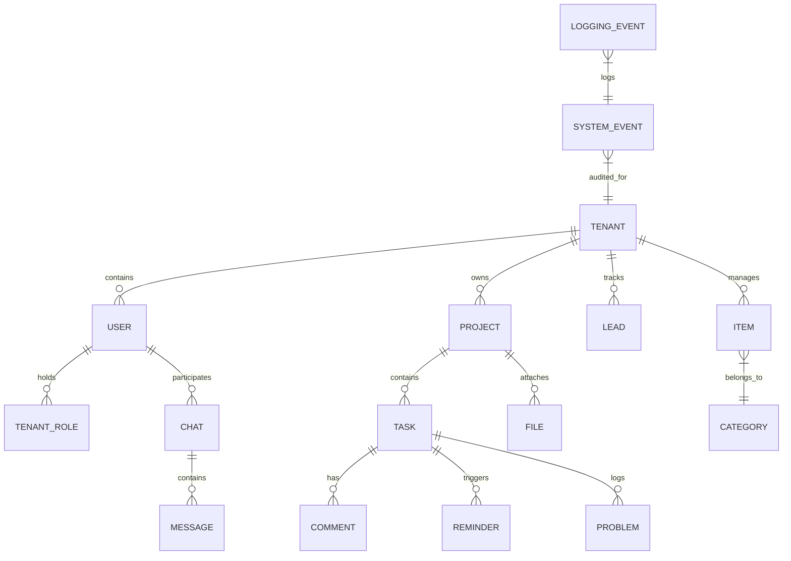

# 🗄️ Relationales Datenbank-Modell

Dieses Dokument beschreibt das relationale Datenbankschema für Handwerk AI. Das Schema ist mandantenfähig (multi-tenant) aufgebaut, um eine strikte Datentrennung zwischen den Handwerksbetrieben zu garantieren.

## 1. Entity-Relationship-Diagramm (ERD)

---

## 2. Tabellen-Definitionen & Schema-Details

### 2.1 Mandant & Benutzer (Core-Modul)

#### `Tenant`
Zentrales Mandanten-Objekt (z.B. ein spezifischer Malerbetrieb).
- `id` (UUID, PK): Eindeutiger Mandanten-Identifikator.
- `name` (VARCHAR): Name des Handwerksbetriebs.
- `created_at` (TIMESTAMP): Registrierungsdatum.

#### `User`
Benutzer im System (Mitarbeiter des Betriebs oder externe Auftraggeber).
- `id` (UUID, PK): Eindeutige User-ID.
- `email` (VARCHAR): E-Mail-Adresse für Logins.
- `password_hash` (VARCHAR): Passwort-Hash (Argon2).
- `first_name` (VARCHAR) / `last_name` (VARCHAR): Name.

#### `TenantRole`
Zuordnung von Berechtigungen pro Mandant.
- `id` (UUID, PK)
- `tenant_id` (UUID, FK -> Tenant.id): Mandant.
- `user_id` (UUID, FK -> User.id): Benutzer.
- `role` (ENUM): Rolle (`admin`, `staff`, `external`).

---

### 2.2 CRM & Projektverwaltung (Betriebs-Modul)

#### `Lead`
Interessenten und Anfragen von Neukunden (wichtig für den [[Lead_Manager]]).
- `id` (UUID, PK)
- `tenant_id` (UUID, FK)
- `contact_name` (VARCHAR): Name des Ansprechpartners.
- `phone` / `email` (VARCHAR)
- `status` (VARCHAR): Status des Leads (z.B. `neu`, `kontaktiert`, `angebot_erstellt`, `archiviert`).

#### `Project`
Ein konkretes Bauvorhaben oder Projekt.
- `id` (UUID, PK)
- `tenant_id` (UUID, FK)
- `name` (VARCHAR): Projektname (z.B. "Sanierung Bad - Hauptstraße 4").
- `description` (TEXT): Beschreibung.
- `status` (VARCHAR): `geplant`, `in_arbeit`, `abgeschlossen`.

#### `Task`
Aufgaben und Arbeitsschritte innerhalb eines Projekts.
- `id` (UUID, PK)
- `project_id` (UUID, FK -> Project.id)
- `assigned_to` (UUID, FK -> User.id): Zugewiesener Mitarbeiter.
- `title` (VARCHAR): Titel der Aufgabe.
- `status` (VARCHAR): `todo`, `in_progress`, `done`.
- `due_date` (TIMESTAMP): Fälligkeit.

---

### 2.3 Kommunikation & Medien (Ingestion-Modul)

#### `File`
Dokumente, Baustellenfotos oder Transkriptionen.
- `id` (UUID, PK)
- `project_id` (UUID, FK, nullable): Zugeordnetes Projekt.
- `file_path` (VARCHAR): S3/MinIO Pfad zur physischen Datei.
- `mime_type` (VARCHAR): Dateityp.
- `size_bytes` (INTEGER): Dateigröße.

#### `Comment`
Kommentare und Notizen zu Tasks.
- `id` (UUID, PK)
- `task_id` (UUID, FK)
- `author_id` (UUID, FK -> User.id)
- `content` (TEXT): Inhalt des Kommentars.

#### `Chat` & `Message`
Verlauf der Multi-Agenten-Interaktionen (Manager-Agent mit Sub-Agenten oder Nutzer-Chat).
- `Chat`: `id` (UUID, PK), `user_id` (UUID, FK), `title` (VARCHAR)
- `Message`: `id` (UUID, PK), `chat_id` (UUID, FK), `sender` (VARCHAR), `text` (TEXT), `timestamp` (TIMESTAMP)

---

### 2.4 Lager & Materialien (Katalog-Modul)

#### `Item`
Materialien, Werkzeuge oder Dienstleistungsposten.
- `id` (UUID, PK)
- `tenant_id` (UUID, FK)
- `name` (VARCHAR): Materialname (z.B. "Gipskartonplatte 2000x1250x12.5").
- `sku` (VARCHAR): Artikelnummer.
- `stock` (INTEGER): Lagerbestand.

#### `Category` & `CategoryItem`
Klassifizierung von Materialien.
- `Category`: `id` (UUID, PK), `name` (VARCHAR)
- `CategoryItem`: `id` (UUID, PK), `category_id` (UUID, FK), `item_id` (UUID, FK)

---

### 2.5 Audit & Events (System-Modul)

#### `SystemEvent`
Audit-Log über Aktionen im System (z.B. "Rechnung freigegeben", "WhatsApp empfangen").
- `id` (UUID, PK)
- `tenant_id` (UUID, FK)
- `event_type` (VARCHAR): Ereignistyp.
- `payload` (JSONB): Strukturierte Eventdaten.
- `created_at` (TIMESTAMP)

#### `WorldEvent`
Externe Einflussfaktoren (z.B. Wetterwarnungen, Feiertage), die Agenten zur Planung nutzen.
- `id` (UUID, PK)
- `description` (VARCHAR)
- `event_date` (DATE)

#### `LoggingEvent`
Deep-Execution Logs zur Fehleranalyse für den Administrator.
- `id` (UUID, PK)
- `system_event_id` (UUID, FK, nullable)
- `level` (VARCHAR): `DEBUG`, `INFO`, `WARNING`, `ERROR`.
- `message` (TEXT): Fehlermeldung oder Logzeile.
- `traceback` (TEXT, nullable)
